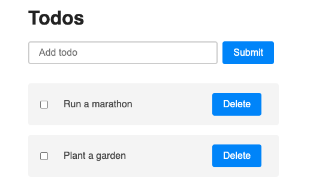

# MVC-todo-app, vanilla JavaScript, HTML, CSS, MVC Design Pattern

## Overview
Simple Todo App created with MVC from Scratch with client-side vanilla JavaScript. Todos can be added or deleted

## Details
- Simple Todo list to add and delete todos

